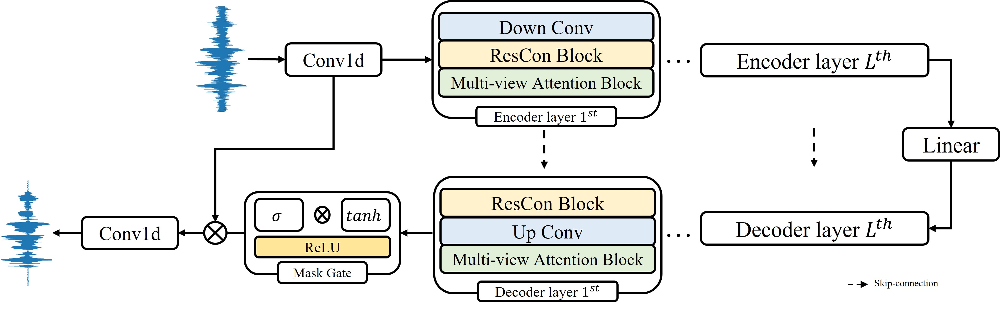

# MANNER (Multi-view Attention Network for Noise ERasement)

This is a Pytorch implementation of MANNER: Multi-view Attention Network for Noise ERasement. MANNER is a deep learning model for speech enhancement in time-domain. MANNER consists of encoder-decoder based on U-net. Each encoder and decoder contains Up/Down conv, Residual Conformer block, and Multi-view Attention block. MANNER representing full information of the signal efficiently addresses channel and long sequential features. Experimental results on the VoiceBank-DEMAND dataset suggest that MANNER achieves state-of-the-art performance. In addition, among time-domain models, MANNER shows efficient results in terms of inference speed and memory usage.

The overall architecture of MANNER is as below:

<p align="center">
	
</p>

# Installation & Enviornment

The OS, python and pytorch version needs as below:
- Windows
- Linux 
- python >= 3.7.4
- pytorch == 1.7.1
- torchaudio == 0.7.2

Notice that if you use windows, "tempo" and "speed" augmentation based on sox are not available. You need to use "shift" augmentation.

You can install requirements through git and requirements.txt except for pytorch and torchaudio.
```C
git clone https://github.com/winddori2002/MANNER.git
cd MANNER
pip install -r requirements.txt
```

# Prepare for usage

## 1. Prepare dataset

We use VoiceBank-DEMAND (Valentini) dataset consisting of 28 speakers for training MANNER. 

- The dataset can be downloaded [here](https://datashare.ed.ac.uk/handle/10283/2791).
- We use [282,287] speakers as validation set.

## 2. Downsample

The sample rate of the dataset is 48kHz.

For a fair comparison we downsample the audio files from 48kHz to 16kHz.

- To downsample the audio, run the following code and edit the directorys.

```
python downsampling.py
```
  
- In the downsampleing.py script, you should change the contents as follows.
  
```
downsample_rate = 16000
clean_train_path = 'The original clean trainset path'
noisy_train_path = 'The original noisy trainset path'
clean_test_path = 'The original clean testset path'
noisy_test_path = 'The original noisy testset path'
resample_path = 'Resampled path'
```
  
## 3. Make data path files

We make json file consisting of the audio path for loading data efficiently. Train (clean, noisy) and 
Test (clean, noisy): four json files need to be generated for training. 

Noitce that the data is downsampled.

- To make json file, run the following code and edit the directorys.

```
python make_datapath.py
```

- In the make_datapath.py script, you should change the contents as follows.

```
clean_train_path = 'The resampled clean trainset path'
noisy_train_path = 'The resampled noisy trainset path'
clean_test_path = 'The resampled clean testset path'
noisy_test_path = 'The resampled noisy testset path'
```

# How to use

## 1. Train

### Training with default settings

You can train MANNER with default setting by running the following code.

```
python main.py train --aug True --aug_type tempo
```

### Training with other arguments
If you want to edit model settings, you can run the following code with other arguments. 

In configuration.py, you can find other arguments, such as batach size, epoch, and so on.

```
python main.py train --hidden 60 --depth 4 --growth 2 --kernel_size 8 --stride 4 --segment_len 64 --aug True --aug_type tempo

MANNER arguments:
  --in_channels: initial in channel size (default:1)
  --out_channels: initial out channel size (default:1)
  --hidden: channel size to expand (default:60)
  --depth: number of layers for encoder and decoder (default:4)
  --kernel_size: kernel size for UP/DOWN conv (default:8)
  --stride: stride for UP/DOWN conv (default:4)
  --growth: channel expansion ration (default:2)
  --head: number of head for global attention (default:1)
  --segment_len: chunk size for overlapped chunking (default:64)
  
Setting arguments:
  --sample_rate: sample_rate (default:16000)
  --segment: segment the audio signal with seconds (default:4)
  --set_stride: Overlapped seconds when segment the signal (default:1)
  
Augmentation arguments:
  --aug: True/False 
  --aug_type: augmentation type (tempo, speed, shift available. only shift available on Windows.)
```

### Training with logging

The logs are uploaded on [neptune.ai](https://neptune.ai/)
```
python main.py train --logging True --logging_cut -1

Logging arguments:
  --logging: True/False
  --logging_cut: log after epochs when the epoch is bigger than logging_cut
```

## 2. evaluation

After training, you can evaluate the model in terms of PESQ and STOI by running the code below.
You need to keep the model arguments in training phase.
```
python main.py test --save_enhanced True --enhanced_path []

evaluation arguments:
  --save_enhanced: saving enhanced audio file
  --enhanced_path: enhanced file directory
```

If you want to evaluate with all measures (PESQ, STOI, CSIG, CBAK, CVOL), run the following code.
```
python eval_measure.py

clean_path = 'test clean path'
enhanced_path = 'enhanced path'
```


## 3. Pretrained weights

The pretrained weights of MANNER is uploaded on github.


# Experimental Results

|Model|PESQ|STOI|CSIG|CBAK|CVOL|
|:---:|:---:|:---:|:---:|:---:|:---:|
|MANNER (small)|3.12|95|4.45|3.61|3.82|
|MANNER|3.21|95|4.53|3.65|3.91|
